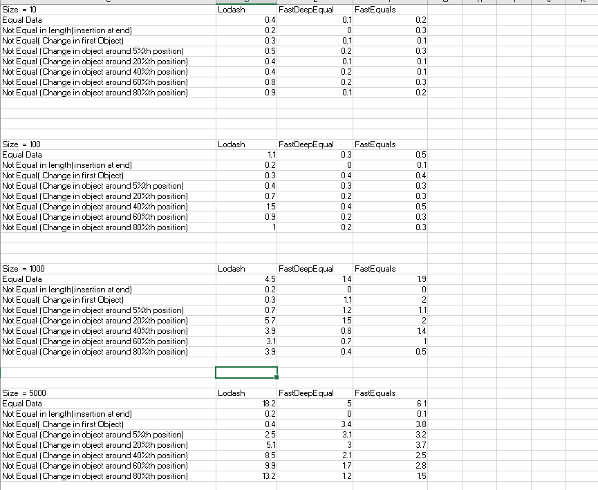

In this repo I've conducted performance benchmarks on various packages such as lodash, fast-deep-equals, and fast-equals to determine which one performs best for checking deep equality.

From my benchmarks, 'fast-deep-equal' proved to be 3-5 times faster than 'lodash.isEqual'.

Another package, 'fast-equals', showed similar performance to 'fast-deep-equal'. Overall, 'fast-deep-equal' stood out as the faster option. 

However, I noticed that 'lodash.isEqual' performs better in certain cases, especially when there are changes in the starting positions in an array of objects. 

**Below timings are in millisecs.**

Attaching the links of other sites which shows similar results:

https://socket.dev/npm/package/react-fast-compare

https://github.com/planttheidea/fast-equals   

